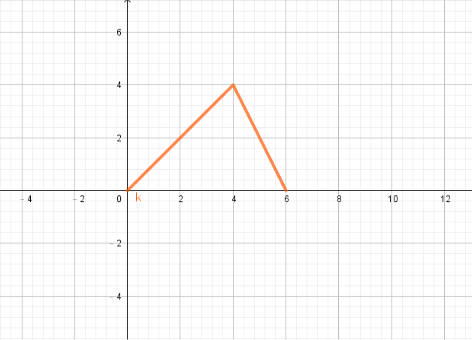
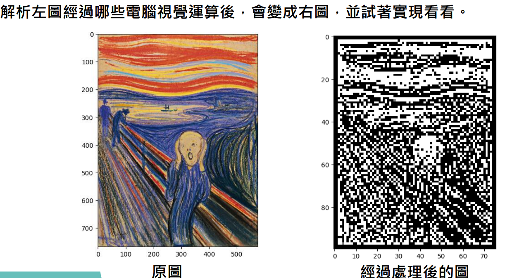

# COMPUTER VISION IN DEEP LEARNING IMPLEMENTATION AND ITS APPLICATIONS

## 隨堂作業一
主要在colab環境下以python來針對特定function繪圖

 

## 隨堂作業二
透過 edge detector 描繪影像線條,並且透過取樣方式回原本四分之一倍和使用Bicubic、bilinear及nearest-neighbor interpolation將影像解析度提升成原本的四倍,最後使用Harris Detector找出影像的features

 

## Assignment1
訓練一個NN分類器,將資料集分成(訓練集:驗證集:測試集)=(8:1:1)並正確分類和畫出學習曲線

 

## Assignment2
訓練一個CNN分類器用於手寫辨識的分類任務

 

## Midterm Project
使用Rock Paper Scissors Dataset,並透過ResNet18來做分類任務, 其中使用了一些前處理技巧(例如: data augmentation)

 

## Final Project
主要是透過強化學習的方式去訓練模型完成特定任務, 並且透過自訂reward function自訂獎懲機制使遊戲能盡可能過關, 分兩個專案實作, 一個是馬利歐, 另一個是俄羅斯方塊 !