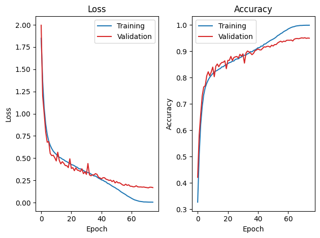

# N26141931_Lab3_Report

## 1. Model Architecture (10%)

* **forward**實作方式: 
  (i)Quantize input 
  (ii)conv1 -> bn1 -> relu  
  (iii)Pass through 4 residual layers
  (iv)Classification head 
  (v)Dequantize output
  
* **fuse_model**實作方式: 
  (i)Define the modules to fuse for the main layers  
  (ii)Fuse modules within each residual block

* **說明:**
把Conv+BN(+ReLU) 都融合，保留殘差加法後ReLU不動，並以QuantStub/DeQuantStub把整個主幹包在整數域中執行，這樣同時達到推論更快與量化更穩的效果，因此能夠高效推論且具備良好的量化就緒性。

## 2. Training and Validation Curves (10%)

**Plot training vs. validation loss** and **training vs. validation accuracy** for your best baseline model.

* Discuss whether overfitting occurs, and justify your observation with evidence from the curves.
**說明:**
此訓練狀況表示並沒有出現明顯overfitting情況，仍在可被接受的範圍之內，原因是在驗證loss部分並無在特定epoch後開始攀升，反而下降，代表模型的收斂維持良好的泛化能力

## 3. Accuracy Tuning and Hyperparameter Selection (20%)

- **Data Preprocessing:** 可透過對資料簡單旋轉甚至縮放來達成augmenation，並且以此方式讓模型學習更多樣化的特徵來提升模型的generalization ability

- **Parameter Smoothing:** 使用Exponent Moving Average方式更新參數，使得模型具有較為平滑的參數來讓輸出較穩定，同時也可抑制overfitting，對模型的收斂是極具有助益
- **Hyperparameters:** 
learning rate=0.0125、optimizer=SGD
scheduler=CosineAnnealingLR、batch size=16
weight decay=5e-4、momentum=0.9、epochs=75

- **Ablation Study (Optional, +10% of this report):**

| Batch Size| Loss Function | Optimizer | Scheduler | Weight Decay / Momentum | Epochs |Test Accuracy|
| -------------- | ------------- | --------- | --------- | ----------------------- | ------ | -------------- |
|16|CrossEntropy|SGD|CosineAnnealingLR|5e-4 / 0.9|70|94.6% |
|16|CrossEntropy|SGD|CosineAnnealingLR|5e-4 / 0.9|75|95.11% |

**說明:** 
因為模型並非很大，故以此超參數設定搭配Augmentation+EMA來訓練model，其中小batch對應中低learning rate控制梯度變異及提升泛化，SGD+momentum+weight decay平滑更新權重，而CosineAnnealingLR平滑降低學習率，讓模型在整個訓練過程能快速學習且穩定收斂作為後續量化（QAT）策略。

## 4. Custom QConfig Implementation (25%)

1. **Scale and Zero-Point:** 
Scale代表「浮點數值與整數之間的縮放比例」，控制每一個整數quantization level對應到的實際數值差距。Zero-Point是讓浮點數的0對應到一個整數值（非必為 0）,它的作用是校正offset，確保量化後的整數能正確表示正負值範圍

2. **CustomQConfig Approximation:** 
以浮點數所算出原始scale近似成硬體友善的形式，方便於INT8/INT32核心中用「整數乘法＋位移」進行實作，以此減少浮點開銷與累積誤差

3. **Overflow Considerations:** 
scale_approximate()可能發生溢位，在乘數求值、整數乘法中間值與大規模累加最常見。預防方法解是透過限制乘數位寬＋更寬中間精度＋右移捨入＋clamp＋穩健校準＋必要時分段/更寬累加器來將風險降到極低，同時維持速度與準確率

## 5. Comparison of Quantization Schemes (25%)

Provide a structured comparison between **FP32, PTQ, and QAT**:

- **Model Size:** Compare file sizes of FP32 vs. quantized models.
- **Accuracy:** Report top-1 accuracy before and after quantization.
- **Accuracy Drop:** Quantify the difference relative to the FP32 baseline.
- **Trade-off Analysis:** Fill up the form below.

| Model   | Size (MB) | Accuracy (%) | Accuracy Drop (%) |
|---------|-----------|--------------|-------------------|
| FP32    |94.41      |95.11         |0                  |
| PTQ     |24.12      |95.12         |-0.01               |
| QAT     |24.115695  |94.86         |0.25               |

## 6. Discussion and Conclusion (10%)

- Did QAT outperform PTQ as expected?
**Ans:** 從上面第5點結果來看，QAT的準確度略遜於PTQ，但在模型大小QAT略勝於PTQ

- What challenges did you face in training or quantization, and how did you address them?
**Ans:** 需要開很多帳號調參訓練，因為根據超參數的設定會影響訓練速度，再加上baseline之test accuracy卡在94%左右，為了在test accuracy超過95%特別詢問AI可以針對超參數或哪些技巧調整來使test accuracy≧95%

- Any feedbacks for Lab3 Quantization? 
**Ans:** 報告要額外繳md檔案有點突然，只能上Hackmd透過MarkDown語法看排版，但我至少要有基本教學和使用方式，否則對沒接觸過的學生會造成額外困擾
