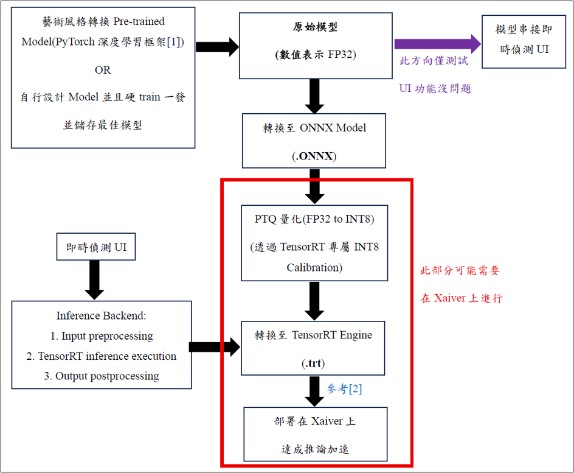
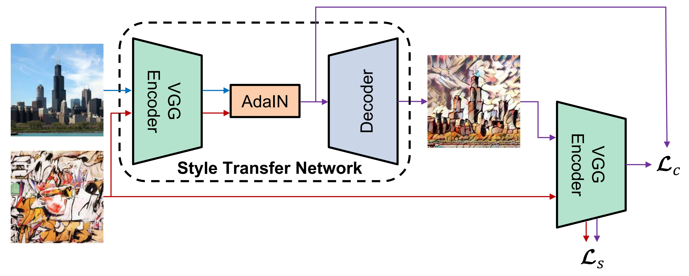
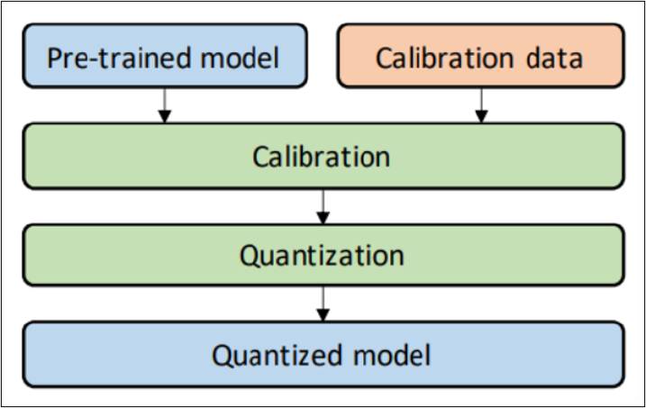
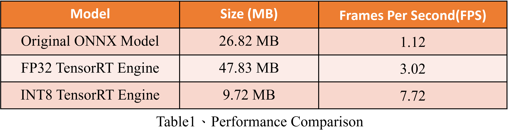
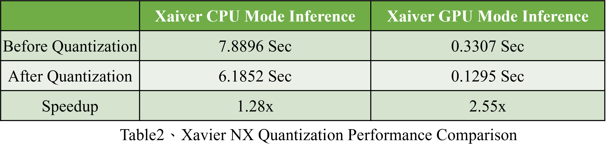
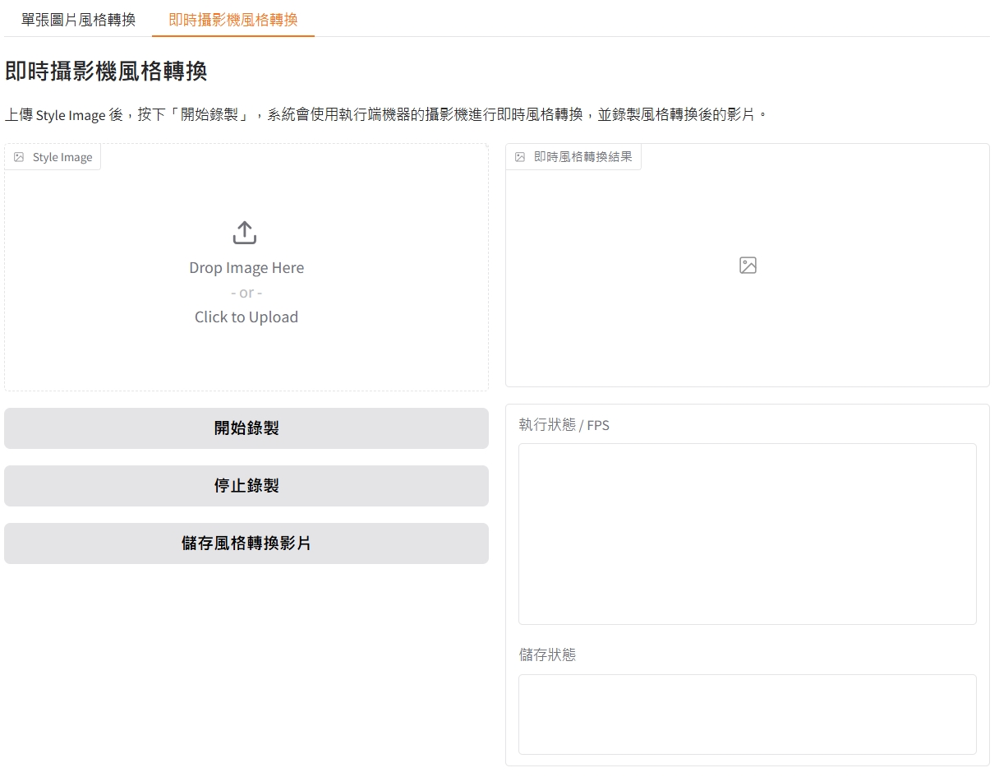
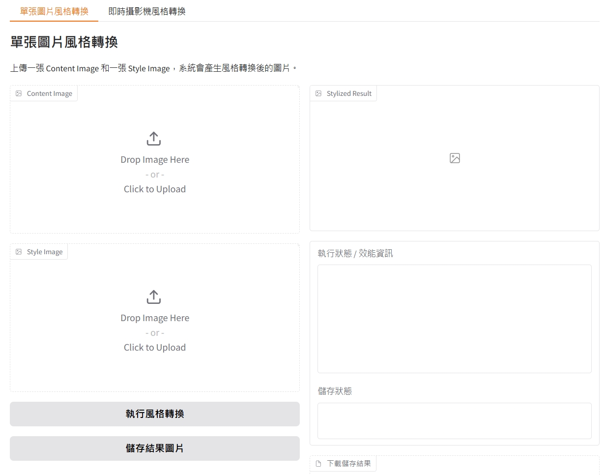
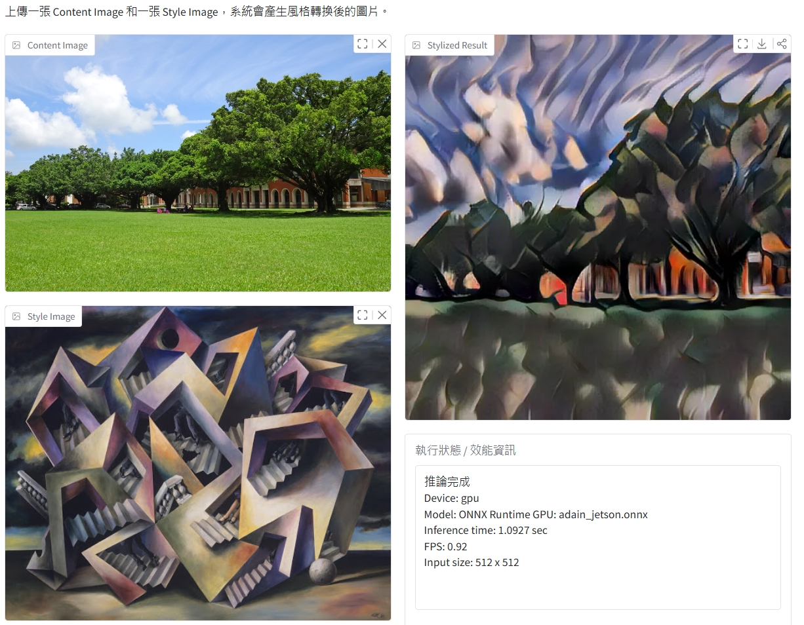

# [Project2] A Real-Time Style Transfer System

## Description
- 擔任專案領導者、規劃Pipeline及PTQ實作

- 本專案主要做即時影像風格轉換並最後部署邊緣裝置Xaiver中達成推論

- 透過找尋預訓練風格轉換模型並使用Post Training Quantization進行模型量化使其最終能在Xaiver上使用TensorRT在XaiverGPU模式下達成推論加速

- 使用TensorRT的推論運行速度比只用CPU快40倍且量化前後模型壓縮率達80%,在Xaiver之GPU模式上量化更達成2倍加速(speedup)

 

## Workflow Pipeline Design

**Source:** 呂建篁
 

## Model Architecture

**Reference Paper:**  
Arbitrary Style Transfer in Real-time with Adaptive Instance Normalization. Xun Huang, Serge Belongie. ICCV 2017 

**Style Dataset:** Painter by Numbers dataset

**Scene Dataset:** COCO 2014 Training dataset

 

## Post Training Quantization

**動機:**
- 考量裝置在運算資源有限
- 不追求精度

**Calibration Data:**  
同上面Style Dataset及Scene Dataset,只選用20張作為校正使用，目的在於讓模型各層 activation 在「真實資料」下數值分布

**Xaiver端:**
- 在Xaiver上進行PTQ量化(從模型FP32至TensorRT INT8)

- 使用TensorRT INT8專屬Calibrator進行校正

- 將量化後模型搭配Xaiver在GPU Mode 達成推論加速

- 對Weight和Activate進行量化

 

## Quantization Results

## GUI And Demo

