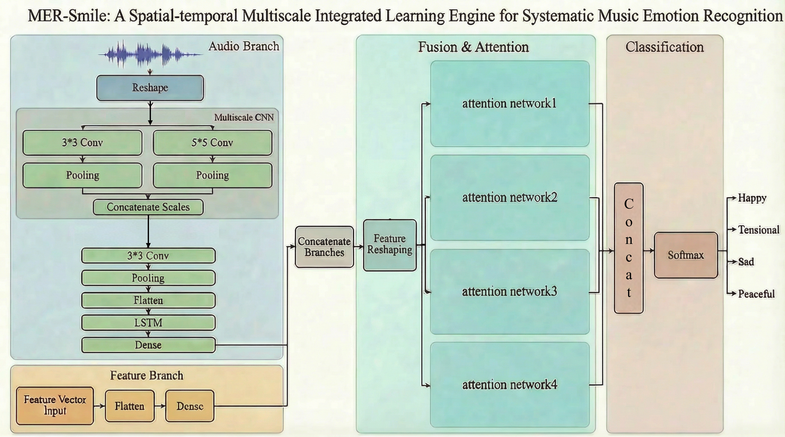

# Music Emotion Recognition Project
## Description
本專案主要針對音樂去分析對應的四類情緒(Happy、Tensional、Sad、Peaceful)，下圖為模型架構，主要使用多尺度CNN捕捉局部的音樂特徵和全局的音樂特徵並串接，透過LSTM維持音樂時序關係，並使用Attention Network去聚焦各個情緒的特徵學習，最後透過Softmax進行情緒分類任務。

 

## Dataset
Source: https://github.com/IanChen5273/Music-emotion/tree/main/music-emotion/song

 

### UI

 

### Model Overview

 

### Results
  

