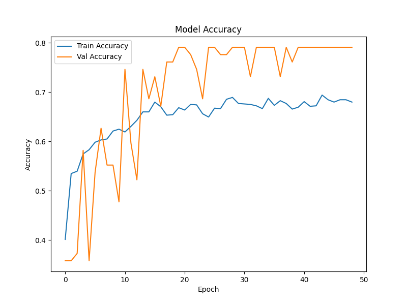
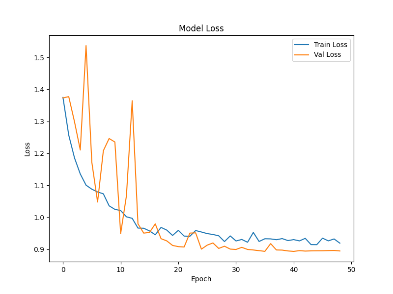

# Music Emotion Recognition Project1
## 描述
本專案主要針對音樂去分析對應的四類情緒，下圖為模型架構，主要使用多尺度CNN捕捉局部的音樂特徵和全局的音樂特徵並串接，透過LSTM維持音樂時序關係，最後使用Attention Network去聚焦各個情緒的特徵學習，最後透過Softmax進行情緒分類任務
![Fig1][Fig/Model.png]

實驗結果如下:  
  

